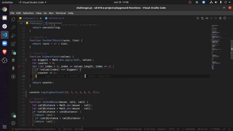

# Boas vindas ao repositório do projeto Playground Functions

Esse projeto foi desenvolvido como um projeto avaliativo do curso de Desenvolvimento Web da [Trybe](https://www.betrybe.com/?utm_medium=cpc&utm_source=google&utm_campaign=Brand&utm_content=ad03_din_h), o objetivo desse projeto era praticar o uso de funções e condições em JavaScript.

Feito apenas com propósitos educacionais.

---

## Preview do projeto

---

## Instalação do projeto localmente

Após cada um dos passos, haverá um exemplo do comando a ser digitado para fazer o que está sendo pedido, caso tenha dificuldades e o exemplo não seja suficiente, não hesite em me contatar em *iago.pferreiravr@gmail.com*.

Passo 1. Abra o terminal e crie um duretório no local de sua preferência com o comando `mkdir`:

~~~bash
mkdir projetos-iago
~~~

Passo 2. Entre no diretório que você acabou de criar:

~~~bash
cd projetos-iago
~~~

Passo 3. Clone o projeto:

~~~bash
git clone git@github.com:IagoPFerreira/playground-functions.git
~~~

Passo 4. Após terminado a clonagem, abra o diretório clonado, abra o diretório `src` e dê um duplo clique no arquivo `chanllenges.js` ou `chanllenges2.js`, cada arquivo possui conjuntos de funções, cada uma das funções pode ser usada em outros projetos via importação.

---
